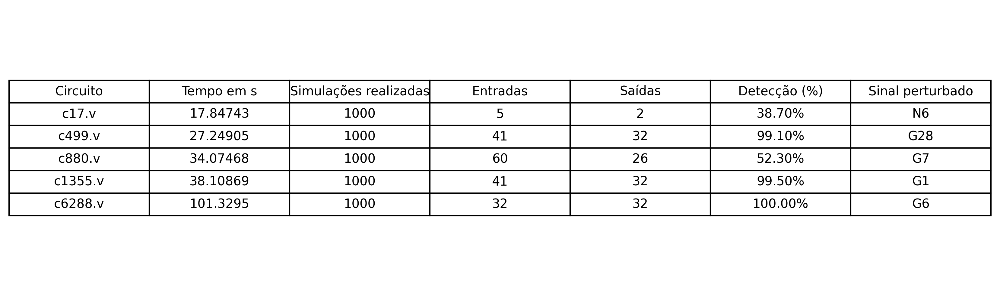

# Implementação em FPGA de uma Framework para Análise de Confiabilidade de Circuitos Combinacionais Usando Inferência Bayesiana Aproximada

**Autor:** José Gustavo Victor Pinheiro Alencar  
**Instituição:** ICMC-USP

---

## 1. Introdução

Este projeto tem como objetivo desenvolver uma framework que permita analisar a confiabilidade de circuitos combinacionais através da injeção de falhas (stuck‑at) e da geração automática de vetores de teste usando algoritmos de ATPG (como PODEM). Além disso, a framework integra a simulação dos circuitos via Icarus Verilog com a extração do design (netlist) utilizando o Pyverilog e possibilita a análise de confiabilidade por meio de inferência bayesiana aproximada. O fluxo também contempla a eventual implementação do design em FPGA para validação em hardware real.

---

## 2. Estrutura do Projeto

A estrutura de arquivos do projeto é organizada da seguinte forma:

- **pyverilog_extractor.py**: Módulo que utiliza o Pyverilog para extrair a AST do código Verilog e organiza as informações dos módulos, portas (inputs, outputs, inouts) e conexões em um dicionário. Pode salvar essa estrutura em um arquivo JSON para análises posteriores.
- **simulator.py**: Módulo que gera vetores de teste aleatórios (com opção de definir a seed) com base nas portas de entrada extraídas. Cria automaticamente um testbench Verilog (em dois modos: circuito “bom” e circuito com uma porta perturbada para simular uma falha), chama o Icarus Verilog via `subprocess` para compilar e simular o design e processa os resultados.
- **main.py**: Arquivo principal que integra o fluxo completo. Ele chama o extractor para gerar a netlist, inicializa o simulador combinacional, gera o vetor de teste, executa as simulações (sem e com falha) e compara os resultados para indicar se a falha foi detectada.

---

## 3. Funcionamento do Código

### 3.1 Extração do Design com Pyverilog

- **Objetivo:** Ler o arquivo Verilog e extrair a estrutura do circuito, identificando os módulos, bem como as portas de entrada e saída.  
- **Como funciona:**  
  - O módulo `pyverilog_extractor.py` utiliza a função `parse()` do Pyverilog para obter a AST do design.
  - Inicialmente, os nomes dos sinais são extraídos a partir da *portlist* do módulo.  
  - Em seguida, o código percorre as declarações (itens do tipo `Decl`) para identificar os sinais que são declarados como `Input`, `Output` ou `Inout` e registra essas informações (direção e largura) em um dicionário.
  - Por fim, a estrutura completa é armazenada no objeto `self.structure` e pode ser salva em JSON.

### 3.2 Simulação do Circuito com Icarus Verilog

- **Objetivo:** Simular o circuito combinacional utilizando o Icarus Verilog e testar a detecção de falhas.  
- **Fluxo de Simulação:**  
  1. **Geração de Vetores de Teste Aleatórios:**  
     - O módulo `simulator.py` gera um vetor de teste aleatório para as entradas extraídas automaticamente da netlist.
     - É possível definir uma *seed* para reprodutibilidade dos testes.
  2. **Criação Automática do Testbench:**  
     - O simulador gera dinamicamente um arquivo de testbench Verilog.  
     - No modo “bom”, o testbench aplica os valores gerados às entradas e imprime as saídas usando `$display`.
     - No modo “com falha”, após um pequeno delay, o testbench força uma porta específica (por exemplo, a porta “b”) a assumir o valor oposto ao definido inicialmente, simulando assim uma falha.
  3. **Compilação e Execução com Icarus Verilog:**  
     - O script utiliza `subprocess` para chamar `iverilog` (para compilar) e `vvp` (para executar a simulação).
     - A saída da simulação é capturada e processada, buscando linhas que comecem com `"OUTPUT:"`.
  4. **Comparação dos Resultados:**  
     - Os resultados obtidos na simulação do design “bom” e do design com a falha são comparados.  
     - Se as saídas diferirem, a falha foi detectada.

## 4. Atualizações
- Implementação do PODEM:
   - Problemas: para implementar o PODEM, preciso de uma netlist mais completa e detalhada, já que o algoritmo irá analisar bem a fundo o codigo
      - Solução: utilizar o Yosys para gerar uma netlist mais detalhada e completa, que pode ser utilizada pelo algoritmo PODEM para análise mais aprofundada do código. 

## 5. Testes realizados

## 6. Estudo sobre falhas
Para complementar o repositório, vou anotar aqui o meu estudo sobre falhas em sistemas digitais. Como referencias vou utilizar os livros/artigos:

**1. Plataforma para testes de circuitos digitais.**
   *Hennes, Marco André Binz*

[Artigo](https://repositorio.unisc.br/jspui/handle/11624/297)

**2. Digital Systems Testing and Testable Design**
   *Miron Abramovici, Melvin A. Breuer, Arthur D. Friedman*

[Livro](https://ieeexplore.ieee.org/book/5266057)

**3. Aumento da testabilidade do hardware com auxilio de técnicas de teste de software**
   *MARGRIT RENI KRUG*
[Artigo](https://www.lume.ufrgs.br/handle/10183/12672)
# Introdução:

---

## Fontes e Artigos Utilizados

1. **Pyverilog: A Python-Based Hardware Design Processing Toolkit for Verilog HDL**  
   *Shinya Takamaeda-Yamazaki (2015).*  
   Apresenta a ferramenta Pyverilog e suas aplicações na análise de designs Verilog.  
   [Springer DOI](https://doi.org/10.1007/978-3-319-16214-0_42)

2. **Icarus Verilog: Open-Source Verilog More Than a Year Later**  
   *Stephen Williams e Michael Baxter (2002).*  
   Descrição do simulador Icarus Verilog e suas funcionalidades.  
   [Linux Journal](https://www.linuxjournal.com/article/6001)

3. **Diagnosis of Automata Failures: A Calculus and a Method**  
   *J. P. Roth (1966).*  
   Artigo seminal que introduziu o D-Algorithm para geração de testes.  
   [IEEE Xplore](https://ieeexplore.ieee.org/document/5392030)

4. **An Implicit Enumeration Algorithm to Generate Tests for Combinational Logic Circuits**  
   *Prabhu Goel (1981).*  
   Apresenta o algoritmo PODEM para geração de testes para circuitos digitais.  
   [IEEE Xplore](https://ieeexplore.ieee.org/document/1675757)

5. **On the Acceleration of Test Generation Algorithms**  
   *Hideo Fujiwara e Takeshi Shimono (1983).*  
   Discussão sobre o algoritmo FAN para geração de testes e melhorias de desempenho.  
   [IEEE Xplore](https://ieeexplore.ieee.org/document/1676133)

6. **Simulated Fault Injection Using Simulator Modification Technique**  
   *Jongwhoa Na e Dongwoo Lee (2011).*  
   Técnica para simulação de injeção de falhas em modelos Verilog.  
   [ETRI Journal](https://onlinelibrary.wiley.com/doi/10.4218/etrij.11.0110.0106)

7. **A Framework for Reliability Analysis of Combinational Circuits Using Approximate Bayesian Inference**  
   *Shivani Bathla e Vinita Vasudevan (2023).*  
   Aplica inferência bayesiana para estimar a confiabilidade de circuitos combinacionais.  
   [IEEE Xplore](https://ieeexplore.ieee.org/document/10026780)

8. **Fault, an Open Source DFT Toolchain**
   *Mohamed Gaber, Manar Abdelatty, and Mohamed Shalan*
   [Woset](https://woset-workshop.github.io/PDFs/2019/a13.pdf)